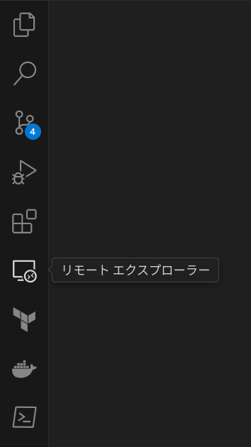

# docker-develop-for-kubernetes
[Docker](https://www.docker.com/)で[Kubernetes](https://kubernetes.io/ja/docs/home/)開発環境を構築する。

<br>

# Requirement
以下のlocalhost環境で動作確認済み<br>
- [Fedora](https://fedoraproject.org/ja/)39
- [Windows](https://www.microsoft.com/ja-jp/windows/)10

<br>

Hostに[VSCode](https://code.visualstudio.com/Download)と以下のVSCode拡張機能をInstallする。
- [Docker](https://marketplace.visualstudio.com/items?itemName=ms-azuretools.vscode-docker)
- [Remote Development](https://marketplace.visualstudio.com/items?itemName=ms-vscode-remote.vscode-remote-extensionpack)

<br>

# Installation
git cloneコマンドで本Repositoryを任意のディレクトリ配下にcloneする。

<br>

# Settings
[.env](./.env)を設定することで、任意の設定でContainerを実行する事が可能である。

## 実行ユーザー名の設定
[.env](./.env)内の`USER_NAME`にコンテナ起動後の実行ユーザーを設定する。

```
USER_NAME = ${実行ユーザー名}
```

<br>

## コンテナイメージ名の設定
[.env](./.env)内の`IMAGE_NAME`を任意のコンテナイメージ名に変更する。

```
IMAGE_NAME = ${コンテナイメージ名}
```

<br>

> [!WARNING]
> コンテナイメージは以下の命名規則に従うこと。<br>
> `^[a-z0-9][a-z0-9_.-]{1,}$`

<br>

> [!NOTE]
> [DockerHub](https://hub.docker.com/)へコンテナイメージのPUSHを想定する場合は以下の命名規則に従うこと。
> ```
> IMAGE_NAME = ${DockerHubユーザー名}/${コンテナイメージ名}:${タグ名}
> ```

<br>

## コンテナ名の設定(Optional)
[.env](./.env)内の`CONTAINER_NAME`を任意のコンテナ名に変更する。
<br>
コンテナ名が起動中のコンテナと重複しないように留意する。

```
CONTAINER_NAME = ${コンテナ名}
```

<br>

## ボリューム名の設定(Optional)
[.env](./.env)内の`VOLUME_NAME`を任意のボリューム名に変更する。
<br>
ボリューム名が起動中のコンテナと重複しないように留意する。

```
VOLUME_NAME = ${ボリューム名}
```

<br>

## ネットワーク名の設定(Optional)
[.env](./.env)内の`NETWORK_NAME`を任意のネットワーク名に変更する。
<br>
ネットワーク名が起動中のコンテナと重複しないように留意する。

```
NETWORK_NAME = ${ネットワーク名}
```

<br>

## kubectl Versionの設定(Optional)
[.env](./.env)内の`KUBECTL_VERSION`を任意の[kubectl Version](https://relnotes.k8s.io/?areas=kubectl)に設定する。

```
KUBECTL_VERSION = ${kubectl Version}
```

<br>

> [!NOTE]
> [kubectl](https://kubernetes.io/ja/docs/reference/kubectl/)は[kube-apiserver](https://kubernetes.io/docs/reference/command-line-tools-reference/kube-apiserver/)の1つ以内のバージョン(古い、または新しいもの)をサポートする。<br>
>
> 例:<br>
> kube-apiserverが1.29である場合、kubectlは1.30、1.29および1.28がサポートされる。<br>
>
> 参考URL:<br>
> [Supported version skew](https://kubernetes.io/ja/docs/setup/release/version-skew-policy/#kubectl)

<br>

## HostがLinux以外の場合(Optional)
HostがLinux以外の場合は、[docker-compose.yml](./docker-compose.yml)内の`Valid only if the host OS is Linux`とコメントされている行をコメントアウトする。

```yml
    volumes:
      - /etc/passwd:/etc/passwd:ro # Valid only if the host OS is Linux
      - /etc/group:/etc/group:ro # Valid only if the host OS is Linux
```

<br>

# Usage

## コンテナ実行
本Repository直下([docker-compose.yml](./docker-compose.yml)が存在するディレクトリ)で以下のコマンドを実行する。

```bash
docker compose up -d --build
```

<br>

## コンテナ環境へのアクセス
1. VSCodeの拡張機能左メニューから拡張機能`リモートエクスプローラー`を押下する。



<br>

2. プルダウンを`開発コンテナー`に変更し、コンテナ一覧から本リポジトリ名にマウスオーバーする。


<br>

3. 右側に表示される`新しいウィンドウでアタッチする`を押下する。


<br>

## AWS CLI 設定
1. [コンテナ環境へのアクセス](#コンテナ環境へのアクセス)を実施し、Docker環境へアクセスする。

2. [~/.aws/aws_cli_credentials_manager.sh](./kubernetes/aws_cli_credentials_manager.sh)内のREPLACE_MEの箇所を置換する。

```bash
[default]
aws_access_key_id = REPLACE_ME
aws_secret_access_key = REPLACE_ME
region = REPLACE_ME
```

3. 下記コマンドを実行し設定する。

```bash
cd ~/.aws
./aws_cli_credentials_manager.sh
```

4. `~/.aws/credentials`に設定が反映されていることを確認する。

<br>

> [!NOTE]
> `aws_cli_credentials_manager.sh`を使用することで、`~/.aws/credentials`の設定一括管理が可能となる。<br>
> `~/.aws/credentials`はコメントアウトにより、設定を無効化する事が出来ない。<br>
> 一方で、[~/.aws/aws_cli_credentials_manager.sh](./kubernetes/aws_cli_credentials_manager.sh)は設定をコメントアウトし、ShellScriptを実行することで、設定の無効化が可能である。<br>
> `aws_cli_credentials_manager.sh`による設定管理をする場合は、AWS公式より提供されている[aws configure](https://docs.aws.amazon.com/ja_jp/cli/latest/userguide/cli-configure-files.html#cli-configure-files-methods)コマンドの実行は不要となる。

<br>
